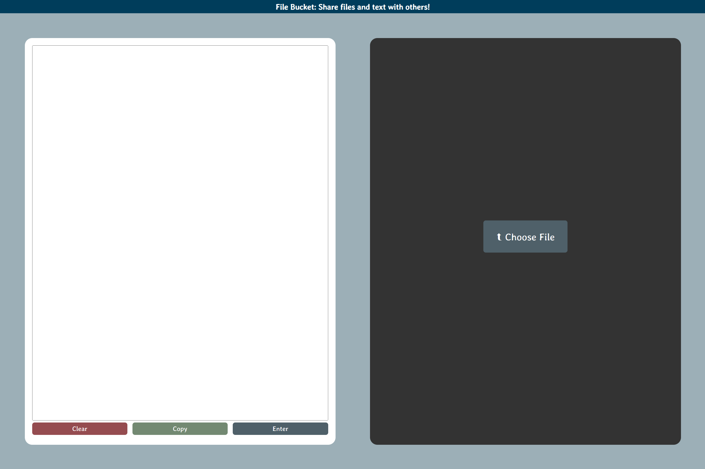

# [FileBucket](https://filebucket.herokuapp.com/)
### A web app where uses can transfer text and files to others over HTTP.

I created **File Bucket** to solve a recurring problem experienced at my job.  I teach 
programming classes offline, and I often want to share a snippet of code or a file with 
a student in an instant. This app addresses issues with sharing media through other 
services such as Zoom or Google Docs. Often sharing text is limited by character length, 
file storage is finite, and users must sign in to their account. This app avoids these 
inconveniences through a well-designed minimalistic and intuitive approach.

The frontend is built with **HTML**, **SASS/CSS**, and **JavaScript**.\
The backend is built with **Django** in Python.\
The storage service utilized previously was **AWS S3** 
but has now been migrated to **Firebase Storage** and **SQLite** serves as the database. \
Check out **filebucket** [**here**](https://filebucket.herokuapp.com/)!